# 🔱 TRINETRA
## Resource-Aware Offline-First Voice Intelligence for Edge Devices

<p align="center">
  <strong>Detect locally • Adapt intelligently • Operate offline • Respond naturally</strong>
</p>

<p align="center">
  TRINETRA is an edge-first voice intelligence architecture that combines
  TinyML wake-word detection, adaptive resource management, online/offline
  speech processing, telemetry-grounded reasoning, and resilient synchronization.
</p>

<p align="center">
  
  
  
  
  
  
</p>

---

# 📑 Table of Contents

1. [Project Overview](#1-project-overview)
2. [Problem Statement](#2-problem-statement)
3. [Motivation](#3-motivation)
4. [TRINETRA at a Glance](#4-trinetra-at-a-glance)
5. [Solution Overview](#5-solution-overview)
6. [Design Philosophy](#6-design-philosophy)
7. [Key Features](#7-key-features)
8. [System Architecture](#8-system-architecture)
9. [Complete Technical Flow](#9-complete-technical-flow)
10. [Audio Pipeline](#10-audio-pipeline)
11. [Environmental Noise Fingerprinting](#11-environmental-noise-fingerprinting)
12. [Adaptive Threshold Manager](#12-adaptive-threshold-manager)
13. [ACWE](#13-acwe)
14. [Energy Gate](#14-energy-gate)
15. [Voice Activity Detection](#15-voice-activity-detection)
16. [TinyML Keyword Spotting](#16-tinyml-keyword-spotting)
17. [DS-CNN](#17-ds-cnn)
18. [Feature Extraction](#18-feature-extraction)
19. [INT8 Quantization](#19-int8-quantization)
20. [Multi-Frame Validation](#20-multi-frame-validation)
21. [Wake-Word Decision](#21-wake-word-decision)
22. [RAAIS](#22-raais)
23. [Dynamic Sampling Strategy](#23-dynamic-sampling-strategy)
24. [Resource Awareness](#24-resource-awareness)
25. [Connectivity Manager](#25-connectivity-manager)
26. [Online Mode](#26-online-mode)
27. [Offline Mode](#27-offline-mode)
28. [ASR](#28-asr)
29. [Offline Queue](#29-offline-queue)
30. [Automatic Synchronization](#30-automatic-synchronization)
31. [Telemetry](#31-telemetry)
32. [Telemetry-Grounded SLM](#32-telemetry-grounded-slm)
33. [Context Construction](#33-context-construction)
34. [Response Generation](#34-response-generation)
35. [TTS](#35-tts)
36. [OLED Interface](#36-oled-interface)
37. [Dashboard and Analytics](#37-dashboard-and-analytics)
38. [End-to-End Architecture](#38-end-to-end-architecture)
39. [Failure and Recovery](#39-failure-and-recovery)
40. [Hardware Architecture](#40-hardware-architecture)
41. [Firmware Architecture](#41-firmware-architecture)
42. [Software Architecture](#42-software-architecture)
43. [AI Architecture](#43-ai-architecture)
44. [Edge-Cloud Architecture](#44-edge-cloud-architecture)
45. [Technology Stack](#45-technology-stack)
46. [Machine Learning Pipeline](#46-machine-learning-pipeline)
47. [Dataset and Data Preparation](#47-dataset-and-data-preparation)
48. [Model Training](#48-model-training)
49. [Model Validation and Testing](#49-model-validation-and-testing)
50. [Model Conversion and Deployment](#50-model-conversion-and-deployment)
51. [Implementation](#51-implementation)
52. [Project Structure](#52-project-structure)
53. [Module Responsibilities](#53-module-responsibilities)
54. [Configuration](#54-configuration)
55. [API and Data Interfaces](#55-api-and-data-interfaces)
56. [Logging and Observability](#56-logging-and-observability)
57. [Testing Strategy](#57-testing-strategy)
58. [Evaluation Metrics](#58-evaluation-metrics)
59. [Benchmarking](#59-benchmarking)
60. [Privacy and Security](#60-privacy-and-security)
61. [Reliability](#61-reliability)
62. [Advantages](#62-advantages)
63. [Technical Novelty](#63-technical-novelty)
64. [Complexity](#64-complexity)
65. [Feasibility](#65-feasibility)
66. [Scalability](#66-scalability)
67. [Sustainability](#67-sustainability)
68. [Impact](#68-impact)
69. [Use Cases](#69-use-cases)
70. [Example Interactions](#70-example-interactions)
71. [Development Workflow](#71-development-workflow)
72. [Installation](#72-installation)
73. [Running the System](#73-running-the-system)
74. [Troubleshooting](#74-troubleshooting)
75. [Deployment](#75-deployment)
76. [Research Directions](#76-research-directions)
77. [Future Enhancements](#77-future-enhancements)
78. [Limitations and Trade-offs](#78-limitations-and-trade-offs)
79. [Design Decisions](#79-design-decisions)
80. [Architecture Comparison](#80-architecture-comparison)
81. [Documentation and Demo](#81-documentation-and-demo)
82. [Team](#82-team)
83. [Contributions](#83-contributions)
84. [Project Status](#84-project-status)
85. [Roadmap](#85-roadmap)
86. [Final Architecture](#86-final-architecture)
87. [Conclusion](#87-conclusion)

---

# 1. Project Overview

TRINETRA is a resource-aware, offline-first voice intelligence system for
constrained edge devices.

The architecture is designed around an ESP32-S3-class controller with dual I2S
microphones and a lightweight TinyML wake-word detector.

Instead of continuously sending microphone audio to a remote service, TRINETRA
keeps the always-listening stage local.

The system first determines whether meaningful speech and the configured wake
word are present.

Only after the wake event is confirmed does the system transition into a
speech-processing stage.

The subsequent speech can follow an online or offline processing path depending
on connectivity and available resources.

The complete concept is:

```text
                ALWAYS-ON EDGE
                     │
                     ▼
             Audio Acquisition
                     │
                     ▼
       Environmental Noise Analysis
                     │
                     ▼
          Adaptive Thresholding
                     │
                     ▼
                    ACWE
                     │
        ┌────────────┼────────────┐
        ▼            ▼            ▼
     Energy         VAD          KWS
      Gate                        │
        └────────────┬────────────┘
                     ▼
            Multi-Frame Validation
                     │
                     ▼
               WAKE CONFIRMED
                     │
                     ▼
              Speech Capture
                     │
              ┌──────┴──────┐
              ▼             ▼
           ONLINE        OFFLINE
              │             │
              ▼             ▼
          Remote ASR      Local ASR
              │             │
              └──────┬──────┘
                     ▼
              Telemetry Context
                     │
                     ▼
              Grounded SLM
                     │
                     ▼
                Response
                 /     \
                ▼       ▼
              Text      TTS
                         │
                         ▼
                      Speaker
```

The architecture separates the inexpensive always-on workload from the more
expensive speech and reasoning workload.

---

# 2. Problem Statement

Conventional voice-assistant architectures often rely heavily on cloud
connectivity.

That architecture creates a mismatch for constrained, remote, disaster-prone,
industrial, or connectivity-variable environments.

The main problems are:

1. Continuous audio transmission consumes bandwidth.
2. Network communication introduces additional latency.
3. Connectivity loss can stop cloud-dependent interactions.
4. Sending ambient audio externally can increase privacy exposure.
5. Embedded devices have limited CPU, RAM, storage, and power.
6. Background noise can cause false wake events.
7. Running a heavy neural network continuously is inefficient.
8. A single fixed inference configuration cannot be optimal under every
   resource condition.
9. A cloud-only pipeline cannot guarantee operation when the network disappears.
10. Device telemetry is often separated from voice reasoning.

TRINETRA addresses these issues through a layered edge-first architecture.

---

# 3. Motivation

The central motivation is to make voice intelligence practical on constrained
hardware without assuming permanent high-bandwidth connectivity.

TRINETRA does not treat edge computing and cloud computing as competing choices.

Instead, it assigns each operation to the most appropriate execution layer.

```text
                    TRINETRA
                        │
        ┌───────────────┼────────────────┐
        │               │                │
        ▼               ▼                ▼
      EDGE            HYBRID           REMOTE
        │               │                │
        ▼               ▼                ▼
  Fast detection   Adaptive path     Heavy compute
  Low bandwidth    Online/offline    Large services
  Local filtering  Synchronization   Remote ASR
```

The architecture therefore attempts to achieve:

- Lower unnecessary communication
- Lower always-on computation
- Better robustness to noise
- Better operation under weak connectivity
- Greater local privacy
- Better use of limited resources
- Context-aware responses

---

# 4. TRINETRA at a Glance

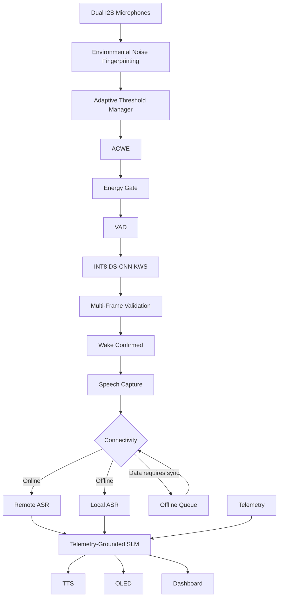

This diagram represents the complete conceptual flow from acoustic input to
context-aware output.

---

# 5. Solution Overview

TRINETRA uses a cascade rather than immediately invoking the most expensive
available model.

The architecture is intentionally progressive:

```text
Stage 1
Cheap acoustic filtering
        ↓
Stage 2
Speech activity detection
        ↓
Stage 3
TinyML keyword classification
        ↓
Stage 4
Multi-frame confirmation
        ↓
Stage 5
Speech capture
        ↓
Stage 6
Online/offline ASR selection
        ↓
Stage 7
Telemetry grounding
        ↓
Stage 8
Response generation
        ↓
Stage 9
TTS / display / analytics
```

The key idea is that each stage reduces uncertainty before the next stage is
activated.

---

# 6. Design Philosophy

## 6.1 Edge First

The wake-word decision is performed locally.

The device does not need to continuously upload ambient microphone data merely
to determine whether the user intends to interact.

## 6.2 Resource Aware

The device monitors its operating conditions and can adapt processing.

## 6.3 Offline First

The system is designed so that loss of connectivity does not automatically
terminate the complete interaction pipeline.

## 6.4 Selective Communication

Communication is activated when it provides useful additional capability.

## 6.5 Context Aware

The reasoning layer can receive relevant device telemetry together with the
recognized user request.

## 6.6 Modular

Each stage can be developed, tested, replaced, and benchmarked independently.

---

# 7. Key Features

| Feature | Purpose |
|---|---|
| Dual I2S microphones | Audio acquisition |
| Environmental Noise Fingerprinting | Understand acoustic environment |
| Adaptive Threshold Manager | Adapt wake detection |
| ACWE | Cascade inexpensive and expensive detection stages |
| Energy Gate | Reject low-energy frames |
| VAD | Identify speech activity |
| TinyML KWS | Local wake-word detection |
| DS-CNN | Lightweight neural inference |
| INT8 quantization | Reduce embedded inference cost |
| Multi-frame validation | Increase decision robustness |
| RAAIS | Adapt inference to device resources |
| Dynamic sampling | Control processing workload |
| Online ASR | Remote speech recognition |
| Offline ASR | Local speech recognition |
| Offline queue | Preserve pending records |
| Auto synchronization | Recover after connectivity returns |
| Telemetry | Represent device state |
| SLM grounding | Generate context-aware responses |
| TTS | Voice response |
| OLED | Local status feedback |
| Dashboard | Monitoring and analytics |

---

# 8. System Architecture

The complete system consists of six major layers.

```text
┌────────────────────────────────────────────────────┐
│                 USER INTERACTION                   │
│             Voice / Text / Response                │
├────────────────────────────────────────────────────┤
│               INTELLIGENCE LAYER                   │
│         Telemetry-Grounded SLM / Logic             │
├────────────────────────────────────────────────────┤
│              SPEECH SERVICES                       │
│             ASR / TTS / Interfaces                 │
├────────────────────────────────────────────────────┤
│                  EDGE AI                           │
│        ACWE / TinyML KWS / RAAIS / VAD             │
├────────────────────────────────────────────────────┤
│                AUDIO LAYER                         │
│       I2S / Buffers / Preprocessing / Noise        │
├────────────────────────────────────────────────────┤
│               HARDWARE LAYER                       │
│     ESP32-S3 / Microphones / OLED / Speaker        │
└────────────────────────────────────────────────────┘
```

The architecture deliberately places the always-on wake pipeline at the edge.

---

# 9. Complete Technical Flow

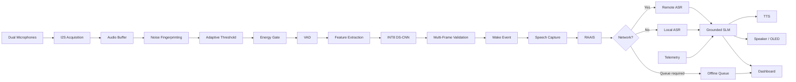

---

# 10. Audio Pipeline

The audio subsystem is the foundation of the wake-word system.

The microphones produce digital audio through the I2S interface.

```text
Microphone 1 ─┐
              ├──> I2S ──> Audio Buffer
Microphone 2 ─┘
                         │
                         ▼
                  Audio Preprocessing
                         │
                         ▼
                  Noise Analysis
                         │
                         ▼
                       ACWE
```

The audio pipeline should maintain deterministic framing so that the feature
extraction stage receives data in the same representation used during model
training.

The key stages are:

1. Audio acquisition
2. Buffering
3. Frame formation
4. Noise analysis
5. Threshold adaptation
6. Energy filtering
7. VAD
8. Feature extraction
9. KWS inference

---

# 11. Environmental Noise Fingerprinting

Environmental Noise Fingerprinting characterizes the acoustic environment.

A voice detector that uses a single static threshold can behave differently in
a quiet room and beside machinery or heavy rain.

TRINETRA therefore separates:

```text
What is the environment doing?
            +
Is there speech?
            +
Is the wake word present?
```

The fingerprinting stage can use measurable acoustic characteristics such as
signal energy and other features available from the audio stream.

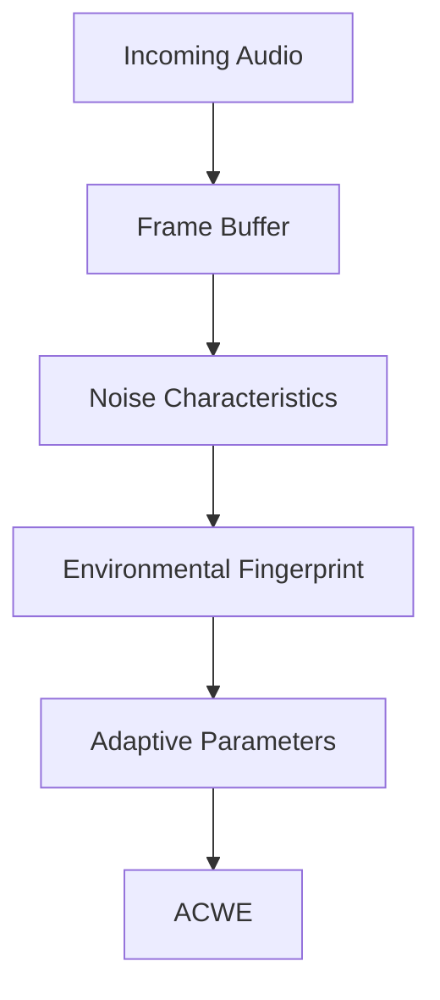

The fingerprint is not itself the wake-word classifier.

Its purpose is to provide environmental context for downstream decisions.

---

# 12. Adaptive Threshold Manager

The Adaptive Threshold Manager converts environmental information into
detection parameters.

```text
Noise Fingerprint
       │
       ▼
┌──────────────────────┐
│ Threshold Estimation │
└──────────┬───────────┘
           │
           ▼
   Detection Parameters
           │
           ▼
          ACWE
```

A conceptual threshold decision is:

```text
if signal_energy < adaptive_threshold:
    reject_candidate
else:
    continue_pipeline
```

The exact threshold policy should be calibrated against the target hardware,
microphone characteristics, environmental conditions, false-accept rate, and
false-reject rate.

---

# 13. ACWE

## Adaptive Cascaded Wake Engine

ACWE is the central always-listening detection pipeline.

The cascade is:

```text
                 AUDIO FRAME
                      │
                      ▼
              ┌──────────────┐
              │  Energy Gate │
              └──────┬───────┘
                     │
              Candidate Activity
                     │
                     ▼
              ┌──────────────┐
              │     VAD      │
              └──────┬───────┘
                     │
                  Speech
                     │
                     ▼
              ┌──────────────┐
              │ TinyML KWS   │
              │  DS-CNN INT8 │
              └──────┬───────┘
                     │
                 Confidence
                     │
                     ▼
              Multi-Frame Check
                     │
                     ▼
               WAKE EVENT
```

The important design principle is **cascaded computation**.

The system does not need to execute the full neural pipeline with equal
frequency on every incoming frame.

---

# 14. Energy Gate

The Energy Gate is the cheapest stage of ACWE.

Its role is to identify frames that do not contain sufficient acoustic activity
to justify further processing.

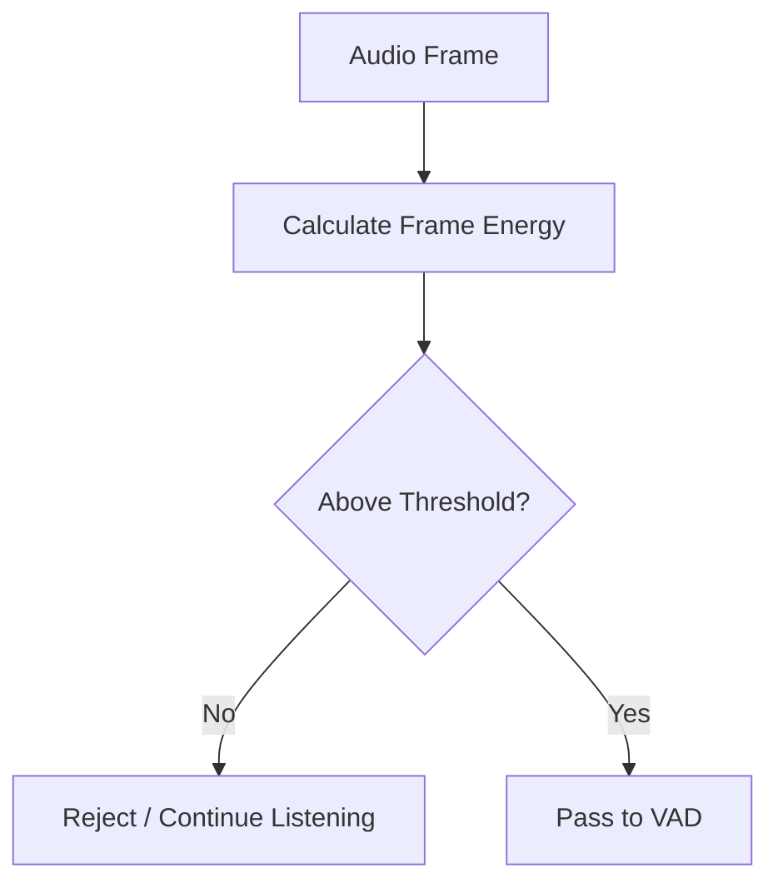

This reduces unnecessary downstream processing.

For an embedded system, this is important because a cheap mathematical
operation can eliminate many frames before neural inference.

---

# 15. Voice Activity Detection

VAD determines whether a candidate frame is likely to contain speech activity.

```text
Energy Gate
     │
     ▼
    VAD
     │
     ├── No Speech ──> Ignore
     │
     └── Speech ────> KWS
```

The VAD stage is not responsible for identifying the wake word.

It only determines whether speech-like activity is present.

This separation keeps the architecture modular.

---

# 16. TinyML Keyword Spotting

TinyML Keyword Spotting performs the actual wake-word classification locally.

```text
Candidate Speech
       │
       ▼
Feature Extraction
       │
       ▼
INT8 DS-CNN
       │
       ▼
Wake-Word Probability
       │
       ▼
Multi-Frame Validation
```

The model is intentionally lightweight so that it can operate continuously on
an embedded controller.

The KWS model should be evaluated using both classification accuracy and
embedded resource metrics.

---

# 17. DS-CNN

DS-CNN stands for:

> Depthwise Separable Convolutional Neural Network

A depthwise-separable convolution separates a conventional convolution into
smaller operations.

Conceptually:

```text
Input Feature Map
       │
       ▼
Depthwise Convolution
       │
       ▼
Pointwise Convolution
       │
       ▼
Activation
       │
       ▼
Next DS-CNN Block
       │
       ▼
Classifier
```

The architecture is useful for TinyML because it can reduce computation and
parameter count compared with a similarly structured conventional convolutional
network.

TRINETRA uses the DS-CNN as the neural stage inside ACWE.

---

# 18. Feature Extraction

The KWS model does not consume arbitrary raw microphone data directly.

The audio is transformed into a representation appropriate for the trained
model.

A typical conceptual pipeline is:

```text
Raw Audio
    │
    ▼
Framing
    │
    ▼
Windowing
    │
    ▼
Spectral Transformation
    │
    ▼
Feature Representation
    │
    ▼
Normalization / Scaling
    │
    ▼
INT8 DS-CNN
```

If MFCC features are used in the implementation, the conceptual process is:

```text
Audio
  ↓
Pre-emphasis
  ↓
Framing
  ↓
Windowing
  ↓
FFT
  ↓
Mel Filter Bank
  ↓
Log Energy
  ↓
DCT
  ↓
MFCC
  ↓
Model Input
```

The deployment feature pipeline must match the training pipeline.

---

# 19. INT8 Quantization

The model is converted from floating-point representation into an INT8
representation suitable for embedded inference.

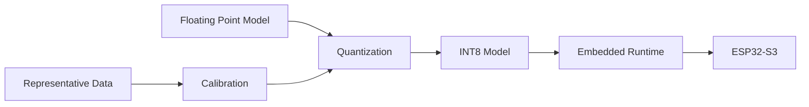

Quantization can provide:

- Smaller model representation
- Lower memory consumption
- Integer arithmetic
- Better embedded execution efficiency

Quantization must be followed by accuracy and hardware validation.

---

# 20. Multi-Frame Validation

A single neural prediction should not automatically become a wake event.

TRINETRA uses multi-frame validation to improve robustness.

The configured concept is:

```text
Frame 1 ──> Positive
Frame 2 ──> Positive
Frame 3 ──> Negative

Positive detections = 2

        ↓

WAKE CONFIRMED
```

Conceptually:

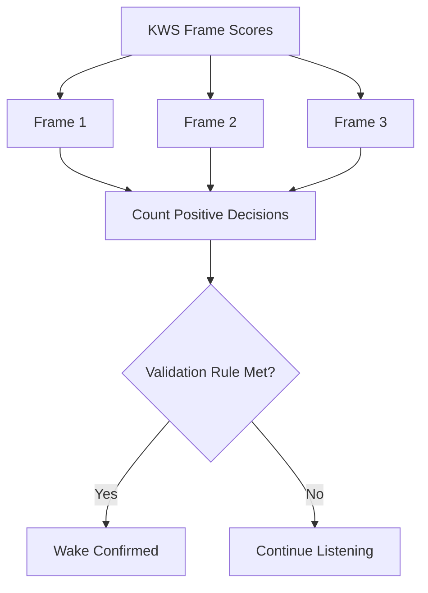

The exact temporal window and confidence thresholds should be calibrated during
testing.

---

# 21. Wake-Word Decision

The final wake decision combines the outputs of multiple stages.

```text
Environment
    ↓
Adaptive Threshold
    ↓
Energy Gate
    ↓
VAD
    ↓
Feature Extraction
    ↓
DS-CNN
    ↓
Confidence
    ↓
Multi-Frame Validation
    ↓
WAKE EVENT
```

This layered decision process is more robust than treating one neural
prediction as sufficient evidence.

---

# 22. RAAIS

## Resource-Aware Adaptive Inference Scheduler

RAAIS is responsible for adapting inference behavior according to current
device conditions.

It can consider:

- CPU utilization
- Available RAM
- Current processing load
- Power/battery state
- System operating state

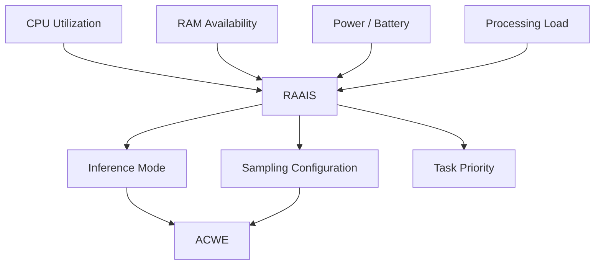

RAAIS does not replace the KWS model.

It controls **when and under which operating configuration** inference should
occur.

---

# 23. Dynamic Sampling Strategy

Dynamic Sampling Strategy is the mechanism through which RAAIS can change the
processing workload.

Conceptually:

```text
                    Resource State
                         │
          ┌──────────────┼──────────────┐
          ▼              ▼              ▼
         CPU            RAM           Power
          │              │              │
          └──────────────┼──────────────┘
                         ▼
                       RAAIS
                         │
                         ▼
                Sampling Decision
                         │
              ┌──────────┴──────────┐
              ▼                     ▼
        Higher Availability    Resource Pressure
              │                     │
              ▼                     ▼
        Higher Processing      Reduced Workload
```

The objective is to avoid spending maximum compute continuously when system
resources are constrained.

---

# 24. Resource Awareness

Resource awareness turns device telemetry into runtime decisions.

```text
┌─────────────────────────────┐
│       RESOURCE MONITOR      │
├─────────────────────────────┤
│ CPU                         │
│ RAM                         │
│ Power / Battery             │
│ Processing Load             │
│ Connectivity                │
└─────────────┬───────────────┘
              │
              ▼
             RAAIS
              │
              ▼
     Runtime Configuration
```

Resource-aware decisions should always be bounded so that adaptation does not
disable essential safety or interaction behavior.

---

# 25. Connectivity Manager

Connectivity is treated as a runtime condition rather than a permanent
assumption.

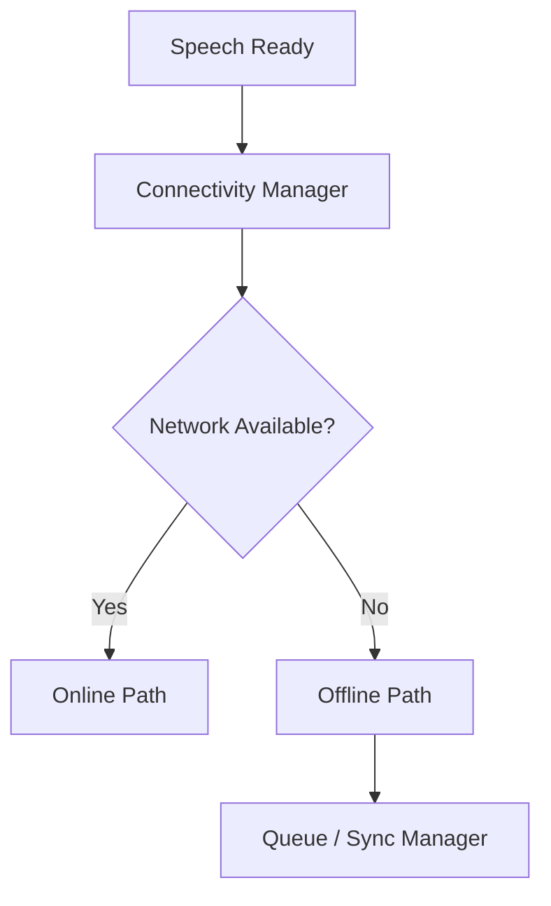

The connectivity manager should expose a simple state to higher-level modules.

Example states:

```text
CONNECTED
CONNECTING
DISCONNECTED
RECOVERING
SYNCING
```

---

# 26. Online Mode

When network connectivity is available, remote processing can be selected.

```text
Wake Event
    │
    ▼
Speech Capture
    │
    ▼
Remote ASR
    │
    ▼
Transcript
    │
    ▼
Telemetry Context
    │
    ▼
SLM
    │
    ▼
Response
    │
    ▼
TTS / OLED
```

The online path can provide access to computationally heavier services while
keeping the wake-word stage local.

---

# 27. Offline Mode

Offline operation removes the network dependency from the immediate interaction.

```text
Wake Event
    │
    ▼
Speech Capture
    │
    ▼
Local ASR
    │
    ▼
Transcript
    │
    ▼
Local Telemetry
    │
    ▼
Local / Available Intelligence
    │
    ▼
Response
    │
    ▼
TTS / OLED
```

The exact offline intelligence capability depends on the selected deployment
models and target hardware.

---

# 28. ASR

ASR stands for:

> Automatic Speech Recognition

Its function is:

```text
Speech Audio
     │
     ▼
     ASR
     │
     ▼
Recognized Text
```

TRINETRA abstracts ASR behind an interface so that online and offline
implementations can share the same downstream processing contract.

```text
                 ASR INTERFACE
                      │
              ┌───────┴───────┐
              ▼               ▼
          Online ASR       Offline ASR
              │               │
              └───────┬───────┘
                      ▼
                   Text
```

---

# 29. Offline Queue

The offline queue stores records that cannot immediately be transmitted.

A queue record should conceptually contain:

```json
{
  "id": "unique-record-id",
  "timestamp": "device-time",
  "type": "telemetry-or-event",
  "payload": {},
  "status": "pending",
  "retry_count": 0
}
```

Queue states:

```text
PENDING
   ↓
TRANSMITTING
   ↓
ACKNOWLEDGED
   ↓
SYNCHRONIZED
```

Failure can return the record to:

```text
PENDING
```

The queue should be bounded by available local storage.

---

# 30. Automatic Synchronization

When connectivity returns, queued records can be synchronized.

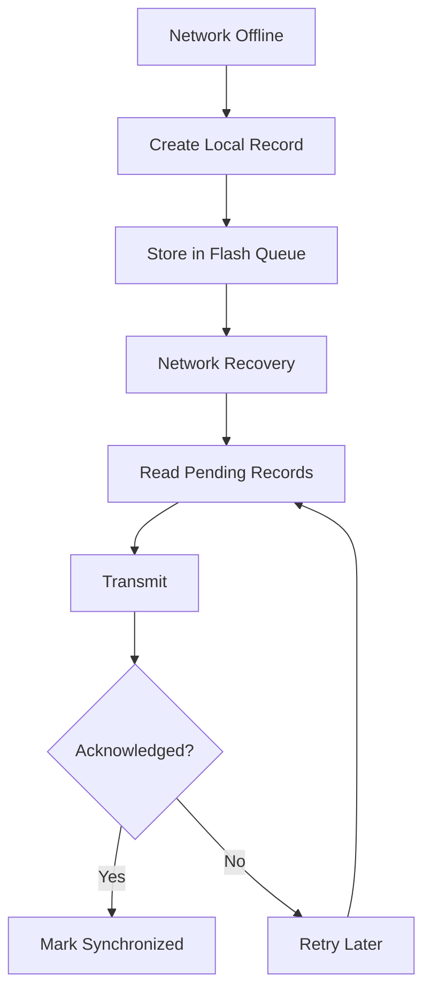

A retry mechanism should prevent a temporary server or network error from
causing data loss.

---

# 31. Telemetry

Telemetry is the system's operational context.

Typical categories include:

```text
DEVICE
 ├── device_id
 ├── firmware_version
 └── uptime

RESOURCE
 ├── cpu_usage
 ├── memory_usage
 └── processing_load

POWER
 └── battery_state

NETWORK
 ├── connectivity
 └── signal_state

AUDIO
 ├── listening_state
 └── noise_state

AI
 ├── KWS state
 ├── inference state
 └── model state

QUEUE
 ├── pending_records
 └── sync_state
```

Telemetry should contain only the information required for operational
awareness and analytics.

---

# 32. Telemetry-Grounded SLM

The reasoning layer can receive the recognized request together with relevant
device telemetry.

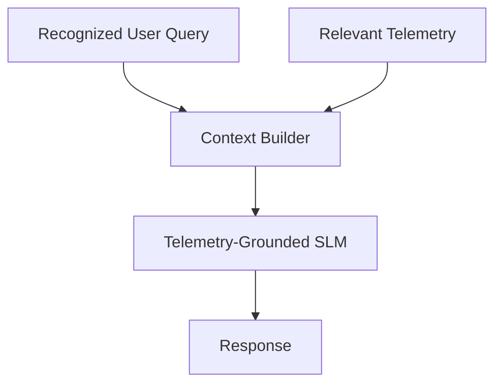

The grounding mechanism reduces the separation between:

```text
WHAT THE USER ASKED
```

and:

```text
WHAT THE DEVICE CURRENTLY KNOWS
```

For example, a response can be conditioned on device state when the query
requires operational context.

---

# 33. Context Construction

The context builder combines only relevant inputs.

```text
┌───────────────────────────────┐
│ User Query                    │
├───────────────────────────────┤
│ Relevant Device Telemetry     │
├───────────────────────────────┤
│ System State                  │
├───────────────────────────────┤
│ Optional Historical Context   │
└───────────────┬───────────────┘
                │
                ▼
        Context Construction
                │
                ▼
               SLM
```

Context construction should avoid unnecessarily passing the entire telemetry
store to the reasoning layer.

---

# 34. Response Generation

The SLM produces response text from the constructed context.

```text
Speech
  ↓
ASR
  ↓
Text Query
  +
Telemetry
  ↓
Context Builder
  ↓
SLM
  ↓
Response Text
```

The response is then routed to the required output interfaces.

```text
                  RESPONSE
                      │
          ┌───────────┼───────────┐
          ▼           ▼           ▼
        OLED         TTS       Dashboard
                      │
                      ▼
                   Speaker
```

---

# 35. TTS

TTS stands for:

> Text-to-Speech

The TTS layer converts generated response text into speech.

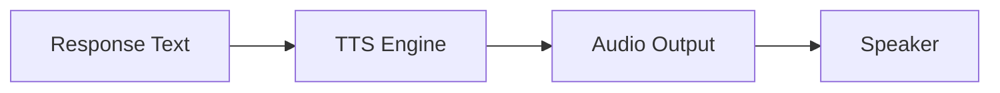

TTS can be local or service-backed depending on deployment constraints.

---

# 36. OLED Interface

The OLED provides immediate local feedback without requiring a phone or
dashboard.

Typical states:

```text
BOOT
  ↓
INITIALIZING
  ↓
LISTENING
  ↓
WAKE DETECTED
  ↓
CAPTURING
  ↓
PROCESSING
  ↓
RESPONDING
  ↓
IDLE
```

Example interface:

```text
┌─────────────────────────┐
│       TRINETRA          │
│                         │
│ STATUS: LISTENING       │
│ MODE: EDGE              │
│ NET: ONLINE             │
│ CPU: ACTIVE             │
└─────────────────────────┘
```

The display should communicate state rather than expose unnecessary diagnostic
complexity to the end user.

---

# 37. Dashboard and Analytics

The dashboard provides system-level visibility.

```text
                 DEVICE
                    │
                    ▼
               Telemetry
                    │
                    ▼
               Backend API
                    │
                    ▼
                Dashboard
                    │
          ┌─────────┼─────────┐
          ▼         ▼         ▼
        Status    Metrics    Events
```

Useful dashboard metrics include:

- Wake events
- KWS confidence
- CPU utilization
- Memory usage
- Connectivity state
- Queue size
- Synchronization state
- Processing mode
- Latency
- System uptime
- Error events

---

# 38. End-to-End Architecture

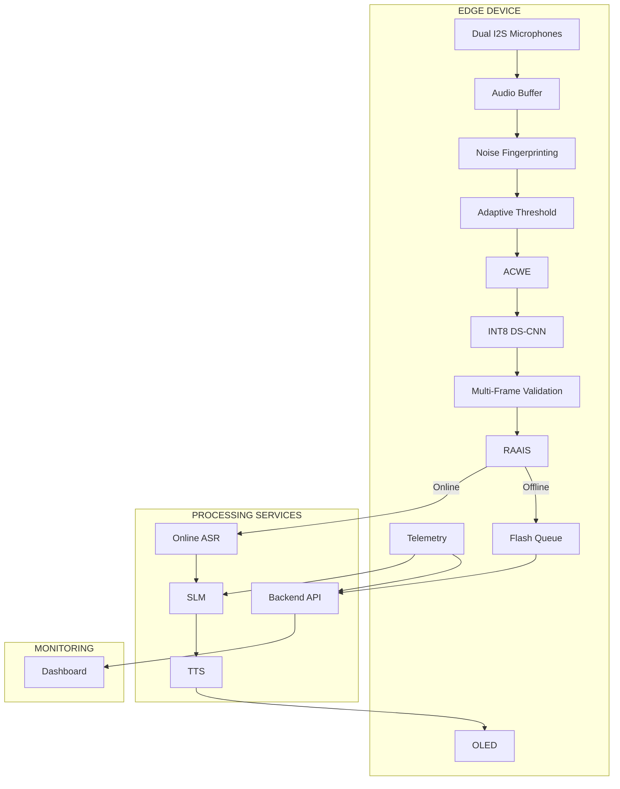

---

# 39. Failure and Recovery

TRINETRA treats failures as expected runtime conditions.

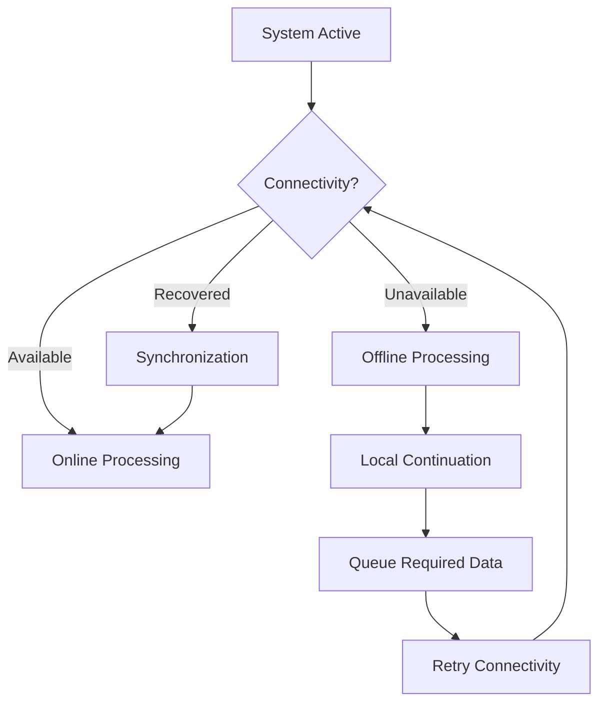

Other possible failure cases include:

```text
Microphone Failure
       ↓
Audio Error State

Model Load Failure
       ↓
Inference Error State

Memory Pressure
       ↓
RAAIS Resource-Safe Mode

ASR Failure
       ↓
Fallback / Retry

TTS Failure
       ↓
Text / OLED Response

Network Failure
       ↓
Offline Mode / Queue
```

---

# 40. Hardware Architecture

The hardware is centered around the embedded controller.

```text
                         ┌───────────────────┐
                         │     ESP32-S3      │
                         │                   │
                         │  ┌─────────────┐  │
                         │  │ TinyML KWS  │  │
                         │  ├─────────────┤  │
                         │  │ ACWE        │  │
                         │  ├─────────────┤  │
                         │  │ RAAIS       │  │
                         │  ├─────────────┤  │
                         │  │ Telemetry   │  │
                         │  └─────────────┘  │
                         └─────┬─┬─┬─────────┘
                               │ │ │
              ┌────────────────┘ │ └────────────────┐
              │                  │                  │
              ▼                  ▼                  ▼
       Dual I2S Mics            OLED             Speaker
```

The design can be adapted to equivalent hardware if the required compute,
memory, interfaces, and audio peripherals are available.

---

# 41. Firmware Architecture

```text
┌────────────────────────────────────────────┐
│              Application Layer             │
├────────────────────────────────────────────┤
│         Voice Interaction Manager          │
├────────────────────────────────────────────┤
│     ACWE │ KWS │ RAAIS │ Telemetry         │
├────────────────────────────────────────────┤
│       Audio / I2S / Buffer Management      │
├────────────────────────────────────────────┤
│       Network / Storage / Display          │
├────────────────────────────────────────────┤
│              Hardware / HAL                │
└────────────────────────────────────────────┘
```

The firmware should be event-driven where practical.

---

# 42. Software Architecture

```text
                    ┌───────────────┐
                    │  Dashboard    │
                    └───────┬───────┘
                            │
                    ┌───────▼───────┐
                    │  Backend API  │
                    └───────┬───────┘
                            │
              ┌─────────────┼─────────────┐
              ▼             ▼             ▼
            ASR            SLM           TTS
              │             │             │
              └─────────────┼─────────────┘
                            │
                    Communication
                            │
                            ▼
                         Firmware
```

---

# 43. AI Architecture

TRINETRA contains two major AI regions.

## Edge AI

```text
Audio
  ↓
Feature Extraction
  ↓
DS-CNN
  ↓
Wake Detection
```

## Application AI

```text
Speech
  ↓
ASR
  ↓
Telemetry + Query
  ↓
SLM
  ↓
Response
```

The two regions solve different problems and therefore can use different model
sizes and execution environments.

---

# 44. Edge-Cloud Architecture

```text
                         TRINETRA
                            │
            ┌───────────────┴────────────────┐
            │                                │
            ▼                                ▼
          EDGE                            REMOTE
            │                                │
     ┌──────┼──────┐                  ┌──────┼──────┐
     ▼      ▼      ▼                  ▼      ▼      ▼
   Audio   KWS   RAAIS               ASR     SLM    TTS
     │      │      │
     └──────┼──────┘
            │
        Local State
            │
        Offline Queue
```

The network therefore becomes an accelerator rather than the only source of
system functionality.

---

# 45. Technology Stack

## Hardware

- ESP32-S3-class microcontroller
- Dual I2S microphones
- OLED display
- Speaker/audio output
- Local flash/storage

## Firmware

- C/C++
- ESP-IDF or compatible embedded framework
- I2S
- Network stack
- Local storage
- Embedded inference runtime

## Machine Learning

- Python
- TensorFlow / TensorFlow Lite tooling where applicable
- TinyML
- DS-CNN
- INT8 quantization
- Keyword spotting

## Speech

- Online ASR
- Offline ASR
- TTS

## Intelligence

- SLM
- Telemetry grounding

## Dashboard

- Web frontend
- Backend API
- Telemetry visualization

---

# 46. Machine Learning Pipeline

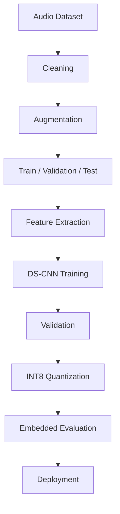

The critical principle is that training and embedded inference must use the same
feature definition and tensor interpretation.

---

# 47. Dataset and Data Preparation

The dataset should represent the target operating conditions.

Recommended classes:

```text
WAKE WORD
    │
    ├── Speaker variation
    ├── Distance variation
    └── Pronunciation variation

NEGATIVE SPEECH
    │
    ├── Similar phrases
    ├── Different speakers
    └── Normal conversation

BACKGROUND
    │
    ├── Silence
    ├── Environmental noise
    ├── Machinery
    ├── Traffic
    └── Weather-related noise
```

Data quality directly affects wake-word performance.

---

# 48. Model Training

A conceptual training workflow is:

```text
Dataset
   ↓
Preprocessing
   ↓
Feature Extraction
   ↓
Training
   ↓
Validation
   ↓
Hyperparameter Adjustment
   ↓
Final Training
   ↓
Test Set
```

Training should avoid leakage between train and test speakers where possible.

The final test set should remain isolated until model selection is complete.

---

# 49. Model Validation and Testing

Validation should examine more than classification accuracy.

Recommended dimensions:

```text
MODEL QUALITY
 ├── Accuracy
 ├── Precision
 ├── Recall
 ├── F1
 └── Confusion Matrix

WAKE-WORD QUALITY
 ├── False Accept Rate
 ├── False Reject Rate
 ├── False Activations / Hour
 └── Detection Latency

EMBEDDED QUALITY
 ├── RAM
 ├── Flash
 ├── CPU
 └── Inference Time
```

---

# 50. Model Conversion and Deployment

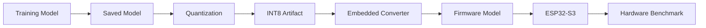

Deployment is not complete until the converted model is tested on the actual
target hardware.

---

# 51. Implementation

Implementation should proceed in layers rather than attempting the complete
system simultaneously.

## Phase 1 — Hardware Bring-Up

```text
ESP32-S3
   ↓
I2S
   ↓
Microphone
   ↓
Audio Samples
```

## Phase 2 — Audio Pipeline

```text
Audio
 ↓
Buffer
 ↓
Energy
 ↓
VAD
```

## Phase 3 — TinyML

```text
Features
 ↓
DS-CNN
 ↓
KWS
```

## Phase 4 — ACWE

```text
Energy Gate
 ↓
VAD
 ↓
KWS
 ↓
Validation
```

## Phase 5 — RAAIS

```text
Telemetry
 ↓
Resource Decision
 ↓
Adaptive Inference
```

## Phase 6 — Speech Services

```text
Wake
 ↓
Speech Capture
 ↓
ASR
```

## Phase 7 — Intelligence

```text
ASR
 +
Telemetry
 ↓
SLM
 ↓
TTS
```

## Phase 8 — Reliability

```text
Connectivity
 ↓
Online / Offline
 ↓
Queue
 ↓
Auto Sync
```

---

# 52. Project Structure

```text
TRINETRA/
│
├── README.md
├── .gitignore
├── LICENSE
├── requirements.txt
├── platformio.ini
│
├── firmware/
│   ├── src/
│   │   ├── main.cpp
│   │   ├── audio/
│   │   ├── acwe/
│   │   ├── kws/
│   │   ├── raais/
│   │   ├── telemetry/
│   │   ├── connectivity/
│   │   ├── queue/
│   │   ├── oled/
│   │   └── tts/
│   │
│   ├── include/
│   ├── models/
│   └── config/
│
├── ml/
│   ├── dataset/
│   ├── preprocessing/
│   ├── features/
│   ├── training/
│   ├── evaluation/
│   ├── quantization/
│   └── models/
│
├── asr/
│   ├── online/
│   ├── offline/
│   └── interface/
│
├── slm/
│   ├── prompts/
│   ├── telemetry/
│   ├── inference/
│   └── interface/
│
├── tts/
│   └── interface/
│
├── backend/
│   ├── api/
│   ├── services/
│   ├── telemetry/
│   └── queue/
│
├── dashboard/
│   ├── frontend/
│   └── backend/
│
├── docs/
│   ├── architecture/
│   ├── diagrams/
│   ├── research/
│   └── testing/
│
├── scripts/
│   ├── setup/
│   ├── training/
│   ├── evaluation/
│   └── deployment/
│
└── tests/
    ├── unit/
    ├── integration/
    ├── system/
    └── hardware/
```

---

# 53. Module Responsibilities

| Module | Responsibility |
|---|---|
| audio | I2S acquisition and buffering |
| noise | Environmental analysis |
| acwe | Wake detection cascade |
| kws | TinyML inference |
| raais | Resource-aware scheduling |
| telemetry | Runtime metrics |
| connectivity | Network state |
| queue | Offline storage |
| sync | Recovery synchronization |
| oled | Local display |
| asr | Speech-to-text |
| slm | Context-aware reasoning |
| tts | Text-to-speech |
| dashboard | Monitoring |
| backend | API and service orchestration |

Each module should expose a small interface.

---

# 54. Configuration

Configuration should be centralized.

Example:

```yaml
device:
  name: "trinetra-node"
  sample_rate: 16000
  channels: 2

kws:
  model: "ds_cnn_int8"
  confidence_threshold: 0.80
  validation_frames: 3
  positive_frames_required: 2

raais:
  enabled: true

network:
  online_mode: true
  offline_mode: true

queue:
  enabled: true
  max_records: 100

telemetry:
  enabled: true
```

These values are examples and should be calibrated against the actual
implementation.

---

# 55. API and Data Interfaces

A modular API architecture can be:

```text
DEVICE
   │
   ▼
POST /api/v1/telemetry
POST /api/v1/events
POST /api/v1/audio
GET  /api/v1/config
GET  /api/v1/status
```

ASR interface:

```text
Audio
 ↓
ASR.request(audio)
 ↓
Transcript
```

SLM interface:

```text
SLM.generate(
    query,
    telemetry,
    context
)
 ↓
Response
```

TTS interface:

```text
TTS.synthesize(text)
 ↓
Audio
```

The exact endpoints should match the deployed backend.

---

# 56. Logging and Observability

Logging should be structured.

Example:

```text
[INFO] BOOT
[INFO] AUDIO_READY
[INFO] KWS_MODEL_READY
[INFO] NETWORK_CONNECTED
[INFO] LISTENING
[INFO] WAKE_DETECTED
[INFO] SPEECH_CAPTURE_STARTED
[INFO] ASR_STARTED
[INFO] ASR_COMPLETED
[INFO] SLM_STARTED
[INFO] RESPONSE_READY
[INFO] TTS_STARTED
[INFO] IDLE
```

Errors:

```text
[ERROR] MIC_INIT_FAILED
[ERROR] MODEL_LOAD_FAILED
[ERROR] ASR_TIMEOUT
[ERROR] NETWORK_TIMEOUT
[ERROR] QUEUE_WRITE_FAILED
[ERROR] TTS_FAILED
```

Logs should not expose secrets or sensitive audio contents.

---

# 57. Testing Strategy

Testing should happen at four levels.

```text
                 TESTING
                    │
       ┌────────────┼────────────┐
       ▼            ▼            ▼
      UNIT       INTEGRATION   SYSTEM
       │            │            │
       └────────────┴────────────┘
                    │
                    ▼
                 HARDWARE
```

Testing should verify both functional correctness and resource behavior.

---

# 58. Evaluation Metrics

Evaluation should cover:

## Detection

- Accuracy
- Precision
- Recall
- F1 score
- False accepts
- False rejects

## Performance

- Wake latency
- ASR latency
- End-to-end latency
- CPU utilization
- RAM utilization
- Storage usage

## Reliability

- Offline success rate
- Queue recovery
- Synchronization success
- Retry behavior

---

# 59. Benchmarking

Benchmark each major stage independently.

```text
Benchmark 1
Energy Gate
   ↓
CPU Cost

Benchmark 2
VAD
   ↓
CPU Cost

Benchmark 3
DS-CNN
   ↓
Inference Time

Benchmark 4
Full ACWE
   ↓
Average Always-On Cost

Benchmark 5
Online Path
   ↓
End-to-End Latency

Benchmark 6
Offline Path
   ↓
End-to-End Latency
```

The final benchmark should use the target embedded hardware and representative
environmental conditions.

---

# 60. Privacy and Security

TRINETRA improves privacy by keeping the always-listening wake detection
stage local.

Conceptually:

```text
Ambient Audio
     │
     ▼
LOCAL PROCESSING
     │
     ├── No Wake ──> Discard / Continue
     │
     └── Wake ────> Speech Capture
                         │
                         ▼
                  Online / Offline
```

Security requirements include:

- Do not hard-code API keys.
- Do not commit passwords.
- Do not commit private keys.
- Do not expose device credentials.
- Use secure transport for network services.
- Validate server responses.
- Authenticate device communication where required.
- Protect local queue data where sensitive.
- Limit dashboard access.
- Avoid storing raw audio unnecessarily.

---

# 61. Reliability

Reliability comes from multiple independent mechanisms.

```text
RELIABILITY
    │
    ├── Cascaded Detection
    ├── Multi-Frame Validation
    ├── Resource Adaptation
    ├── Offline Processing
    ├── Local Queue
    ├── Retry Mechanism
    ├── Auto Synchronization
    └── Telemetry
```

No single component should be assumed to operate perfectly under every
condition.

---

# 62. Advantages

TRINETRA provides several architectural advantages.

### Lower Unnecessary Bandwidth

The always-on wake-word stage remains local.

### Better Connectivity Resilience

Offline operation prevents the network from becoming a single point of failure.

### Better Resource Utilization

RAAIS allows runtime adaptation.

### Lower Always-On AI Cost

ACWE filters candidates before neural inference.

### Context-Aware Intelligence

Telemetry can be used to ground responses.

### Modular Development

Hardware, ML, speech and dashboard components can evolve independently.

---

# 63. Technical Novelty

The novelty is not simply using a wake-word model on an ESP32.

The architecture combines multiple mechanisms into one adaptive pipeline:

```text
Environmental Awareness
        +
Adaptive Thresholding
        +
Cascaded Wake Detection
        +
TinyML DS-CNN
        +
Multi-Frame Validation
        +
Resource-Aware Scheduling
        +
Dynamic Sampling
        +
Online/Offline ASR
        +
Offline Queue
        +
Auto Synchronization
        +
Telemetry-Grounded Intelligence
```

The architectural contribution is the coordinated use of these mechanisms to
support constrained and connectivity-variable voice intelligence.

---

# 64. Complexity

The most technically complex parts are the interactions between independent
subsystems.

## 1. Always-On TinyML

The model must be accurate enough while remaining lightweight.

## 2. Adaptive Cascade

Thresholds, VAD, KWS and temporal validation must work together.

## 3. RAAIS

Resource decisions must improve efficiency without making detection unreliable.

## 4. Offline Reliability

Queueing and synchronization must avoid data loss and duplication.

## 5. Hybrid Intelligence

Online and offline services need a common interface.

## 6. Telemetry Grounding

Telemetry must be transformed into useful reasoning context.

---

# 65. Feasibility

The architecture is feasible because it separates workloads.

```text
LOW COMPUTE
    ↓
Always-on detection
    ↓
ESP32-S3

HIGHER COMPUTE
    ↓
Speech recognition / reasoning
    ↓
Remote service when available

OFFLINE
    ↓
Local models where supported
```

This prevents the embedded controller from being responsible for every
computationally expensive operation at all times.

---

# 66. Scalability

The architecture can scale from a single prototype to multiple edge nodes.

```text
              CENTRAL SERVICES
                     │
          ┌──────────┼──────────┐
          ▼          ▼          ▼
       NODE 01     NODE 02    NODE 03
          │          │          │
        Edge       Edge       Edge
          │          │          │
       Sensors    Sensors    Sensors
```

Each node can maintain its own local state while sharing selected telemetry
with centralized infrastructure.

---

# 67. Sustainability

Resource-aware processing can reduce unnecessary computation.

Selective communication can reduce unnecessary data transfer.

Offline-first operation can reduce dependence on continuously available
network infrastructure.

Local wake detection also avoids continuously transmitting ambient audio solely
for wake-word classification.

The sustainability objective is therefore:

```text
Less unnecessary compute
        +
Less unnecessary communication
        +
Longer useful operation
        =
More efficient edge intelligence
```

---

# 68. Impact

TRINETRA is particularly relevant where connectivity, power, bandwidth or
infrastructure availability cannot be assumed.

Potential impact areas include:

- Remote field operations
- Disaster-response environments
- Industrial environments
- Infrastructure monitoring
- Smart IoT systems
- Robotics
- Remote sensing
- Edge automation

---

# 69. Use Cases

## Remote Voice Interface

A worker can interact with an edge device using voice.

## Industrial Monitoring

The system can combine voice commands with device telemetry.

## Disaster Response

Offline-capable voice interaction can remain useful when connectivity is
intermittent.

## Smart IoT

Voice can provide a local interface to connected sensors and actuators.

## Robotics

A robot can use local wake detection and contextual telemetry.

---

# 70. Example Interactions

## Online

```text
User
 ↓
Wake Word
 ↓
TRINETRA
 ↓
Speech Capture
 ↓
Remote ASR
 ↓
Telemetry + Query
 ↓
SLM
 ↓
Response
 ↓
TTS
 ↓
User
```

## Offline

```text
User
 ↓
Wake Word
 ↓
TRINETRA
 ↓
Speech Capture
 ↓
Local ASR
 ↓
Local Context
 ↓
Available Intelligence
 ↓
Response
 ↓
TTS
 ↓
User
```

---

# 71. Development Workflow

Recommended implementation order:

```text
1. Hardware
   ↓
2. I2S Audio
   ↓
3. Audio Buffer
   ↓
4. Energy Gate
   ↓
5. VAD
   ↓
6. KWS
   ↓
7. ACWE
   ↓
8. RAAIS
   ↓
9. Telemetry
   ↓
10. Connectivity
   ↓
11. ASR
   ↓
12. SLM
   ↓
13. TTS
   ↓
14. Queue
   ↓
15. Sync
   ↓
16. Dashboard
   ↓
17. Integration
```

---

# 72. Installation

## Clone Repository

```bash
git clone <repository-url>
cd TRINETRA
```

## Python Environment

```bash
python -m venv .venv
```

Activate:

### Linux/macOS

```bash
source .venv/bin/activate
```

### Windows

```powershell
.venv\Scripts\activate
```

Install dependencies:

```bash
pip install -r requirements.txt
```

---

# 73. Running the System

A complete development environment consists of:

```text
Firmware
   +
Backend
   +
ASR
   +
SLM
   +
TTS
   +
Dashboard
```

Start services according to the selected deployment configuration.

Example conceptual startup:

```bash
# Terminal 1
cd backend
python main.py

# Terminal 2
cd dashboard
npm install
npm run dev

# Terminal 3
cd firmware
# Build and flash using the configured embedded toolchain
```

The exact commands depend on the selected framework and implementation.

---

# 74. Troubleshooting

## No Microphone Data

Check:

```text
I2S Pins
Sample Rate
Clock Configuration
DMA Buffer
Microphone Power
```

## KWS Never Triggers

Check:

```text
Feature Shape
Feature Scaling
Model Input Type
INT8 Quantization
Confidence Threshold
Multi-Frame Rule
```

## Too Many False Triggers

Check:

```text
Noise Fingerprint
Adaptive Threshold
VAD
KWS Threshold
Validation Window
```

## Offline Mode Not Working

Check:

```text
Local ASR
Local Model Availability
Storage
Queue Initialization
State Machine
```

## Queue Not Synchronizing

Check:

```text
Network State
Authentication
Pending Records
Retry Counter
Server Acknowledgement
```

---

# 75. Deployment

Deployment consists of:

```text
TRAIN
 ↓
VALIDATE
 ↓
QUANTIZE
 ↓
BENCHMARK
 ↓
PACKAGE
 ↓
FLASH
 ↓
CONNECT
 ↓
TEST
 ↓
MONITOR
```

Never treat successful firmware flashing as proof that the entire system works.

End-to-end validation is required.

---

# 76. Research Directions

Potential research directions include:

- More efficient wake-word architectures
- Better noise adaptation
- Learned acoustic fingerprints
- Adaptive confidence thresholds
- Energy-aware inference scheduling
- More efficient local ASR
- Small language models for embedded systems
- Federated learning
- Distributed edge intelligence
- Personalized wake words

---

# 77. Future Enhancements

```text
Current
   ↓
Adaptive KWS
   ↓
Better Noise Robustness
   ↓
Smaller Local ASR
   ↓
Smaller Local SLM
   ↓
Federated Edge Learning
   ↓
Multi-Device Coordination
```

Future versions can introduce stronger models without changing the fundamental
architecture.

---

# 78. Limitations and Trade-offs

TRINETRA does not eliminate the limitations of constrained hardware.

### Compute

Local models have limited capacity.

### Memory

Large speech or language models may not fit on the MCU.

### Accuracy

Offline models may be less capable than remote services.

### Power

Continuous audio acquisition still consumes energy.

### Noise

Extreme acoustic conditions can degrade detection.

### Storage

Offline queues have finite capacity.

### Synchronization

Network recovery can introduce delayed processing.

These trade-offs are explicitly considered in the architecture.

---

# 79. Design Decisions

| Decision | Reason |
|---|---|
| Local KWS | Reduce unnecessary communication |
| Cascaded detection | Reduce expensive inference |
| DS-CNN | TinyML suitability |
| INT8 | Embedded efficiency |
| Multi-frame validation | Reduce isolated false activations |
| RAAIS | Adapt to resource conditions |
| Offline mode | Connectivity resilience |
| Queue | Preserve pending data |
| Auto-sync | Recover after connectivity |
| Telemetry grounding | Context-aware responses |
| OLED | Local visibility |
| Dashboard | System observability |

---

# 80. Architecture Comparison

## Conventional Cloud Voice Pipeline

```text
Microphone
   ↓
Network
   ↓
Cloud KWS / ASR
   ↓
Cloud Intelligence
   ↓
Network
   ↓
Device
```

A connectivity failure can interrupt the complete pipeline.

## TRINETRA

```text
Microphone
   ↓
Local ACWE
   ↓
Local KWS
   ↓
Wake
   ↓
┌───────────────┐
│ Online        │
│      OR       │
│ Offline       │
└───────────────┘
   ↓
ASR
   ↓
Grounded Intelligence
   ↓
Response
```

The main architectural difference is that TRINETRA does not require the network
for the always-on wake detection stage.

---

# 81. Documentation and Demo

Recommended documentation assets:

```text
docs/
├── architecture/
│   ├── system.md
│   ├── audio.md
│   ├── raais.md
│   └── offline.md
│
├── diagrams/
│   ├── system-flow.md
│   ├── acwe.md
│   ├── ml-pipeline.md
│   └── sync.md
│
├── testing/
│   ├── kws.md
│   ├── latency.md
│   └── hardware.md
│
└── research/
    └── references.md
```

For the SIH demonstration, the most important flow to demonstrate is:

```text
Wake
 ↓
Detection
 ↓
Speech
 ↓
Online Response
 ↓
Disconnect Network
 ↓
Offline Response
 ↓
Reconnect
 ↓
Synchronization
```

---

# 82. Team

The project should list the complete SIH team here.

```text
TRINETRA
SIH 2026 Team

Team Lead:
<NAME>

Members:
<NAME>
<NAME>
<NAME>
<NAME>
<NAME>
```

Replace placeholders with the official team information before publishing.

---

# 83. Contributions

Contributions should be organized by subsystem.

Possible ownership:

```text
Hardware
Firmware
TinyML
ASR
SLM
TTS
Backend
Dashboard
Testing
Documentation
```

Each contributor should document interfaces when modifying shared modules.

---

# 84. Project Status

```text
┌─────────────────────────────────┐
│       TRINETRA STATUS           │
├─────────────────────────────────┤
│ Architecture       : Defined    │
│ Edge KWS           : Active     │
│ ACWE               : Active     │
│ RAAIS              : Designed  │
│ Offline Pipeline   : Designed  │
│ Telemetry          : Active     │
│ Dashboard          : Active     │
│ End-to-End Demo    : In Progress│
└─────────────────────────────────┘
```

Update this section as implementation milestones are completed.

---

# 85. Roadmap

```text
Phase 1
Hardware Bring-Up
       ↓
Phase 2
Audio Pipeline
       ↓
Phase 3
TinyML KWS
       ↓
Phase 4
ACWE
       ↓
Phase 5
RAAIS
       ↓
Phase 6
ASR
       ↓
Phase 7
SLM + Telemetry
       ↓
Phase 8
Offline Queue + Sync
       ↓
Phase 9
Dashboard
       ↓
Phase 10
Full System Validation
       ↓
Phase 11
Field Testing
```

---

# 86. Final Architecture

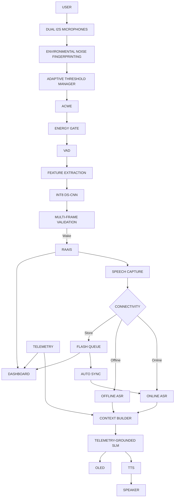

---

# 87. Conclusion

TRINETRA is designed as a complete edge-first voice intelligence architecture
rather than a standalone keyword-spotting model.

Its central idea is:

```text
                TRINETRA
                    │
        ┌───────────┼───────────┐
        ▼           ▼           ▼
      DETECT       ADAPT       RESPOND
        │           │           │
        ▼           ▼           ▼
      TinyML       RAAIS       ASR/SLM
        │           │           │
        └───────────┼───────────┘
                    ▼
                 RESILIENT
                    │
          ┌─────────┴─────────┐
          ▼                   ▼
        ONLINE              OFFLINE
          │                   │
          └─────────┬─────────┘
                    ▼
              CONTEXT-AWARE
                 VOICE AI
```

The architecture combines:

- Local wake-word detection
- Environmental awareness
- Cascaded inference
- Lightweight DS-CNN
- INT8 embedded inference
- Multi-frame validation
- Resource-aware scheduling
- Dynamic sampling
- Online/offline ASR
- Offline queueing
- Automatic synchronization
- Device telemetry
- Telemetry-grounded reasoning
- TTS
- OLED feedback
- Dashboard observability

The resulting system is intended for environments where **compute, power,
bandwidth, privacy, and connectivity cannot be treated as unlimited
resources**.

---

# 🔱 TRINETRA

### Detect locally. Adapt intelligently. Operate offline. Respond naturally.

---

## 📌 Repository Notes

### Recommended `.gitignore`

```gitignore
# Python
__pycache__/
*.py[cod]
*.so
.venv/
venv/
env/

# Environment variables
.env
.env.*
!.env.example

# Secrets
*.pem
*.key
*.crt
secrets/
credentials/

# ML artifacts
*.h5
*.keras
*.ckpt
checkpoints/

# Generated datasets
data/raw/
data/cache/
*.wav
*.mp3

# Build artifacts
build/
dist/
*.o
*.elf
*.bin
*.map

# PlatformIO
.pio/
.piolibdeps/

# IDE
.vscode/
.idea/

# OS
.DS_Store
Thumbs.db

# Logs
*.log
logs/

# Node
node_modules/
npm-debug.log*
```

---

## 📌 Environment Template

Create `.env.example`:

```env
DEVICE_ID=trinetra-node-01

ASR_ENDPOINT=
SLM_ENDPOINT=
TTS_ENDPOINT=

API_KEY=

MQTT_BROKER=
MQTT_PORT=

DASHBOARD_URL=
```

Never commit the real `.env` file.

---

## 📌 Example Runtime State Machine

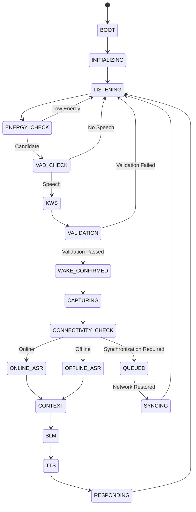

---

## 📌 Resource Decision Example

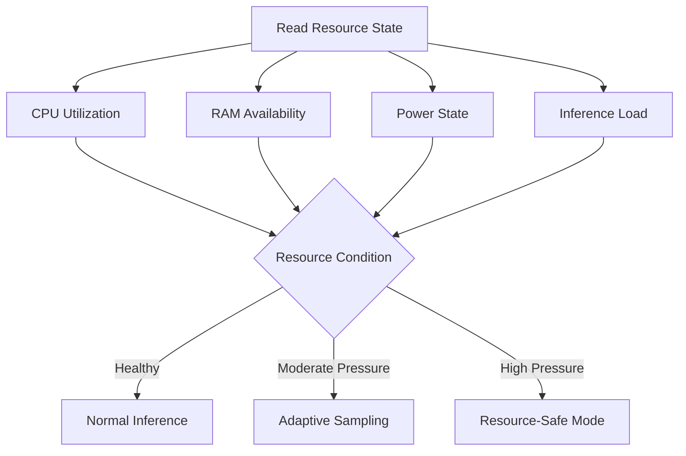

---

## 📌 Offline Queue Lifecycle

```text
                NEW EVENT
                    │
                    ▼
              QUEUE RECORD
                    │
                    ▼
                 PENDING
                    │
              Network Check
                    │
          ┌─────────┴─────────┐
          │                   │
        OFFLINE              ONLINE
          │                   │
          ▼                   ▼
        WAIT                 SEND
          │                   │
          └──────────┬────────┘
                     ▼
                  ACK?
                 /    \
               YES     NO
                │       │
                ▼       ▼
             SYNCED   RETRY
```

---

## 📌 Wake Detection Logic

```text
FOR EVERY AUDIO FRAME:

    1. Acquire audio.

    2. Update environmental noise information.

    3. Update adaptive detection parameters.

    4. Run the Energy Gate.

       IF energy is insufficient:
           return to listening.

    5. Run VAD.

       IF speech is absent:
           return to listening.

    6. Extract model features.

    7. Run INT8 DS-CNN.

    8. Store KWS decision.

    9. Evaluate multi-frame validation.

       IF validation fails:
           continue listening.

    10. If validation succeeds:
            generate WAKE EVENT.

    11. Start speech capture.

    12. Ask RAAIS / connectivity manager
        for the appropriate processing path.
```

---

## 📌 Online/Offline Decision Logic

```text
                 SPEECH CAPTURE
                       │
                       ▼
                CHECK RESOURCES
                       │
                       ▼
               CHECK CONNECTIVITY
                       │
              ┌────────┴────────┐
              │                 │
           ONLINE             OFFLINE
              │                 │
              ▼                 ▼
          REMOTE ASR         LOCAL ASR
              │                 │
              └────────┬────────┘
                       ▼
                    TRANSCRIPT
                       │
                       ▼
                    TELEMETRY
                       │
                       ▼
                 CONTEXT BUILDER
                       │
                       ▼
                       SLM
                       │
                       ▼
                    RESPONSE
```

---

## 📌 Latency Measurement

TRINETRA should measure latency at individual stages.

For example:

```text
T_WAKE
   =
Time at which wake-word completion is detected

T_ASR
   =
Time at which ASR receives speech

T_RESPONSE
   =
Time at which generated response becomes available
```

A useful wake-to-ASR metric is:

```text
T_latency = T_ASR - T_WAKE
```

End-to-end response latency can be measured as:

```text
T_e2e = T_response - T_wake
```

These values should be measured separately for:

```text
ONLINE
OFFLINE
```

because their computational paths differ.

---

## 📌 KWS Evaluation Matrix

```text
                    ACTUAL
              Wake       Non-Wake
          ┌──────────┬───────────┐
Pred Wake │    TP    │    FP     │
          ├──────────┼───────────┤
Pred No   │    FN    │    TN     │
Wake      └──────────┴───────────┘
```

From this:

```text
Precision = TP / (TP + FP)

Recall = TP / (TP + FN)

F1 = 2 × Precision × Recall
     ------------------------
     Precision + Recall
```

For a real always-listening system, false activations over time should also be
measured.

---

## 📌 Complete Demonstration Scenario

### Scenario

The device is operating in a noisy environment.

```text
DEVICE STARTS
     │
     ▼
NOISE FINGERPRINT CREATED
     │
     ▼
ADAPTIVE THRESHOLD UPDATED
     │
     ▼
DEVICE LISTENS LOCALLY
     │
     ▼
ENERGY GATE
     │
     ▼
VAD
     │
     ▼
DS-CNN
     │
     ▼
MULTI-FRAME VALIDATION
     │
     ▼
WAKE CONFIRMED
     │
     ▼
USER SPEAKS REQUEST
     │
     ▼
SPEECH CAPTURE
     │
     ▼
NETWORK CHECK
     │
     ├───────────────┐
     │               │
   ONLINE          OFFLINE
     │               │
     ▼               ▼
 REMOTE ASR       LOCAL ASR
     │               │
     └───────┬───────┘
             ▼
       TELEMETRY CONTEXT
             │
             ▼
            SLM
             │
             ▼
          RESPONSE
             │
        ┌────┴────┐
        ▼         ▼
       OLED      TTS
                  │
                  ▼
               SPEAKER
```

This is the core demonstration path for the complete TRINETRA system.

---

## 📌 Core Engineering Principle

TRINETRA can be summarized as:

```text
DO NOT SPEND MAXIMUM COMPUTE ON EVERY FRAME.

FIRST:
    Filter.

THEN:
    Detect speech.

THEN:
    Run TinyML.

THEN:
    Validate.

ONLY AFTER WAKE:
    Capture speech.

THEN:
    Select online or offline processing.

THEN:
    Ground the request in telemetry.

FINALLY:
    Generate and deliver the response.
```

This principle is what connects the individual TRINETRA components into one
coherent system.

---

# 🔱 TRINETRA — SIH 2026

> **Resource-aware voice intelligence that keeps thinking even when resources
> and connectivity are limited.**
